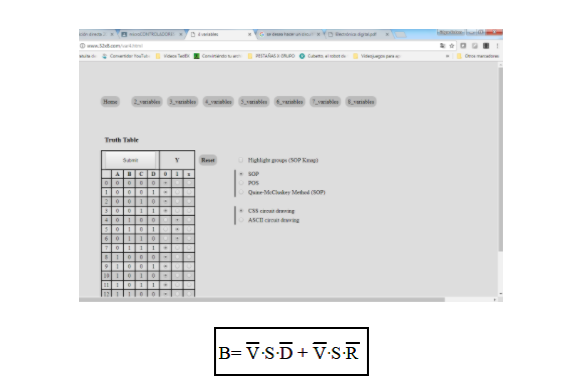
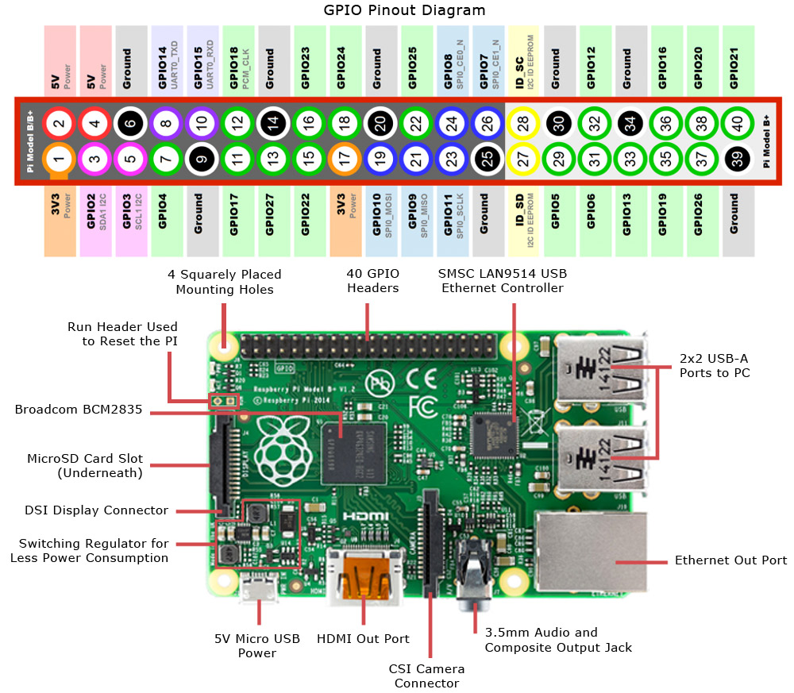

# Producto_Unidad3
# Informe 
##  Implementación de  2 circuitos combinancionales  empleando Python y simulados en una Raspberry Pi.

## 1.PLANTEAMIENTO DEL PROBLEMA

Implementanar 2 circuitos combinancionales con la programacion orientada a objetos (POO) en la plataforma create.withcode.uk

## 2.OBJETIVOS

### General:

Diseñar 2  programas en la Raspberry pi por medio del leguaje de programacióm python

### Específicos:

> Explorar las bibliotecas que nos ofrece pyhon para poder controlar los puertos de la GPIO de la raspberry pi
 
> Comprender la sintaxis y la semántica de la programación orientada a objetos de Python.

## 3.ESTADO DEL ARTE

### Tema: Sistema de identificación y conteo de personas utilizando rambuesa pi

Investigadores: Tussanai Prthonratt, Natchaphon Brapanonte y Wisatute Gunjarueg

Año:  2016

El trabajo se enfoca en un implementación de OpenCV en un incrustado sistema me gusta Raspberry Pi para crear una mini estación independiente para contar La característica clave de AU-PiCC (Assumption University's Contador de clientes de frambuesa Pi) es contar un número de personas interesadas en el producto de destino en un área predefinida a lo largo con una simple identificación facial para evitar contar duplicados. Los resultados experimentales muestran que esta frambuesa basada en Pi sistema se puede utilizar como una simple estación de contador de personas. 

Lugar:Da Nang, Vietnam

### Tema: SMARISA: un anillo inteligente basado en Raspberry Pi para la seguridad de las mujeres con IoT

Investigadores: Navya R. Sogi, Priya Chatterjee, U. Nethra y V. Suma

Año:2018

Todos los días, todas las mujeres, niñas, madres y mujeres de todos los ámbitos de la vida luchan por estar a salvo y protegerse de la mirada errante de los hombres horriblemente insensibles que abusan, asaltan y violan la dignidad de las mujeres a diario. Las calles, el transporte público, los lugares públicos en particular se han convertido en dominio de los cazadores. Debido a estas atrocidades a las que están sometidas las mujeres en el escenario actual, se propone un wearable de seguridad inteligente para mujeres basado en Internet of Things. Se implementa en forma de anillo inteligente (SMARISA) y se compone de Raspberry Pi Zero, cámara Raspberry Pi, timbre y botón para activar los servicios. Este dispositivo es extremadamente portátil y puede ser activado por la víctima al ser asaltada con solo hacer clic en un botón que buscará su ubicación actual y también capturará la imagen del atacante a través de la cámara Raspberry Pi. La ubicación y el enlace de la imagen capturada se enviarán a los números de contacto de emergencia predefinidos o a la policía a través del teléfono inteligente de la víctima, lo que evitará el uso de dispositivos / módulos de hardware adicionales y hará que el dispositivo sea compacto.

Lugar: Coimbatore, India
 
## 4.MARCO TEÓRICO

 
### Python
 
Python fue creado a finales de los ochenta por Guido van Rossum en el Centro para las Matemáticas y la Informática (CWI, Centrum Wiskunde & Informatica), en los Países Bajos, como un sucesor del lenguaje de programación ABC, capaz de manejar excepciones e interactuar con el sistema operativo Amoeba. El nombre del lenguaje proviene de la afición de un grupo británico de comediantes conocidos como Monty Python. (Python, n.d.)
Python es un lenguaje de programación interpretado el cual hace hincapié en la legibilidad de su código. Se trata de un lenguaje de programación multiparadigma, ya que soporta orientación a objetos, programación imperativa y, en menor medida, programación funcional.
Este lenguaje está administrado por la Python Software Foundation. es una organización sin fines de lucro creada el 6 de marzo de 2001 dedicada al lenguaje de programación Python. Es responsable de varios procesos dentro de la comunidad, como el desarrollo de Python, la administración de los derechos intelectuales y de obtener fondos.(Operadores Python ➞ Explicamos Todos Los Operadores + Ejemplos Reales, n.d.)
 

 
Los pasos para comenzar con Python en la programación de una interfaz de usuario no son terriblemente complejos, pero requiere que el usuario empiece a tomar algunas decisiones. Por su naturaleza como un lenguaje de programación de propósito general con intérpretes disponibles en todos los sistemas operativos comunes, Python tiene que ser bastante agnóstico en cuanto a las opciones que presenta para crear interfaces gráficas de usuario.
Afortunadamente, hay muchas opciones disponibles para los programadores que buscan crear una manera fácil para que los usuarios interactúen con sus programas. Existen enlaces para varios frameworks de interfaz de usuario en una variedad de plataformas, incluidas las nativas Windows, Mac y Linux, y muchas que funcionan en las tres.
En este punto, tiene que evaluar bien el hecho de necesitar una interfaz gráfica. Al momento de desarrollar una aplicación, también debe considerar una interfaz web, especialmente si cree que los usuarios puedan querer alojar su aplicación de forma remota, y proyectos como Django, Flask o Pyramid hacen que esto sea sencillo. Incluso puede usar una librería como pywebview para colocar una capa delgada alrededor de una aplicación web en una ventana GUI más nativa.
 
 
 
### RASPBERRY PI
 
Raspberry PI es una placa computadora (SBC) o Pc de placa única, de bajo precio, se podría expresar que es un ordenador de tamaño reducido, del orden de una tarjeta de crédito, desarrollado en el Reino Unido por la Fundación Raspberry PI (Universidad de Cambridge) en 2011, con el objetivo de estimular la enseñanza de la informática en las escuelas, aunque no empezó su comercialización hasta el año 2012. El concepto es el de un ordenador desnudo de todos los accesorios que se pueden eliminar sin que afecte al funcionamiento básico. Está formada por una placa que soporta varios componentes necesarios en un ordenador común y es capaz de comportarse como tal. A la Raspberry Pi la han definido como una maravilla en miniatura, que guarda en su interior un importante poder de cómputo en un tamaño muy reducido. Es capaz de realizar cosas extraordinarias(Yamanoor, Narasimha Saii,Yamanoor, 2013)
 
Los componentes de la Raspberry Pi son:
 
●	Un Chipset Broadcom BCM2835, que contiene un procesador central (CPU) ARM1176JZF-S a 700 MHz (el firmware incluye unos modos Turbo para que el usuario pueda hacerle overclock de hasta 1 GHz sin perder la garantía)
 
●	Un procesador gráfico (GPU) VideoCore IV
 
●	Un módulo de 512 MB de memoria RAM (aunque originalmente al ser lanzado eran 256 MB).
 
●	Un conector de RJ45 conectado a un integrado lan9512 -jzx de SMSC que nos proporciona conectividad a 10/100 Mbps
 
●	2 buses USB 2.0
 
●	Una salida analógica de audio estéreo por Jack de 3.5 mm.
 
●	Salida digital de video + audio HDMI
 
●	Salida analógica de video RCA
 
●	Pines de entrada y salida de propósito general
 
●	Conector de alimentación microUSB
 
●	Lector de tarjetas SD
 
(Yamanoor, Narasimha Saii,Yamanoor, 2013)
 
### Puerto GPIO de la  RASPBERRY PI
 
La placa Raspberry Pi puede comunicarse con dispositivos externos a través del conector GPIO incorporado. En este conector hay pines de alimentación integrados (+5 y +3.3 V), tierra y pines de entrada / salida capaces de implementar diferentes protocolos.
 
Dado que existen dos versiones diferentes de hardware Raspberry Pi (rev. 1 y 2), las asignaciones de puertos también pueden variar. Sin entrar, en este momento, en los detalles de los protocolos, las dos posibles versiones de nuestra Raspberry Pi nos llevan a dos posibles escenarios de hardware. Podemos ver aquí un pin de diagrama comparativo de numeración GPIO.
 
#### Los pines GPIO tienen funciones específicas:
 
El color amarillo (2): Alimentación a 3.3V.
 
El color  rojo (2): Alimentación a 5V.
 
El color naranja (26): Pueden configurarse como entradas o salidas se las conoce también como pines de Propósito General.
 
El color gris (2): Son pines reservados.
 
El color negro (8): Conexión a GND.
 
El color azul (2): Comunicación mediante el protocolo I2C (Circuito inter-integrado).
 
El color verde (2): Destinados a conexión para UART para puerto serie convencional.
 
El color morado (5): Comunicación mediante el protocolo SPI (Es un protocolo síncrono, el cual sincroniza y transmite datos  por medio de 4 señales).
 
 

### Create.withcode.uk online
 
Create.withcode.uk es un editor de python en línea que le permite escribir, ejecutar, depurar y compartir código de python en su navegador web. Se lanzó en abril de 2016 para ayudar a los estudiantes a aprender a escribir código en cualquier dispositivo sin tener que instalar ningún software especializado.

Todos los recursos en este sitio se publican bajo la licencia Creative Commons de uso compartido, lo que significa que puede usar cualquier cosa aquí para cualquier propósito, siempre y cuando me haga referencia como autor original. Sin embargo, hasta ahora, aunque create.withcode.uk ha sido de uso gratuito, el código fuente que lo hace funcionar no ha estado disponible de forma abierta.

Create.withcode.uk ahora es de código abierto. Esto significa que si puede pensar en una forma de mejorar el editor de Python o detecta un error que necesita reparación, no tiene que esperar a que lo codifique: puede saltar y adaptarlo / ampliarlo / mejorarlo te gusta. Puedes usarlo libremente para tus propios proyectos.

#### Prestaciones

> Autoevaluación de pruebas de python que se integran con moodle

> Crea juegos y objetos en 3D usando python

> Cuestionarios interactivos de python que se integran con moodle

## 5. DIAGRAMAS

## 6. LISTA DE COMPONENTES 

#### Diseño una calculadora científica en Python

- Interner
- Plataforma create.withcode.uk online
- Computador
- Python

#### Implementación de una interfaz HMI en NODE-RED

- Internet

- Computador
 
## 7. MAPA DE VARIABLES

## 8. APORTACIONES

## 9. EXPLICACION DEL CODIGO FUENTE

## 10. CONCLUSIONES

- La página https://create.withcode.uk/ la cual puedes crea funciones para ingresar y sacar datos, tiene muchas limitaciones de varias librerías y una de esas es la de librería SYS..
 
- Los nodos que nos ofrece NODE-RED son muy diversos, para poder tener otros nodos de los que vienen por determinado, se tienen que descargar. Pero no solo podemos encontrar nodos hechos por la misma plataforma, también podemos encontrar nodos hechos por usuarios, pero a veces estoy no están del todo bien hechos.

- En conclusión, podemos determinar que node red nos brinda una interfaz gráfica la cual, es amigable para el usuario inclusive para el desarrollo y el diseño del mismo al crear una dashboard debido a que se posee una lista de varios widgets preestablecidos los cuales se los puede  utilizar por la conexión entre nodos de entrada (bottom, dropdown,switch,color picker) lo que vamos a programar y los modos de salida (text, notification, audio out, gauge, chart) que vienen hacer lo que el usuario tiende a visualizar ;cada uno de estos posee parámetros en su configuración, en esta ocasión, se tomaron en cuenta los parámetros de label el cuál va a ser el nombre de nuestro nodo, playload que va a indicar la función que va a cumplir, range el cual crea un rango determinando los valores mínimos y máximos, graphics y colour.

- También podemos decir que la herramienta node red es muy potente y sirve para comunicar el hardware y los servicios de una forma rápida y sencilla simplificando en gran manera la programación del mismo; finalmente, se cumplió nuestro objetivo mediante la elaboración de un proyecto en dashboard el cual es el panel de una casa interactiva el cual era mostrar las elaboración un na dashboard.

 
## 11.RECOMENDACIONES

- Para poder realizar un programa en esta plataforma online hay que saber primero saber lenguaje Python, luego de ya tener los conocimentos vas al siguiente nivel el cual es la programacion dirigido objetos con plus de cono cimiento en activar los pines del Raspberry y poder hacer que se pueda ingresar o sacar datos. Estos pasos a seguir nos facilitara para crear mas facil cualquier proyecto relaccionado al mismo. 

 
## 12. CRONOGRAMA

 
 ## 13.BIBLIOGRAFÍA:

- Rupil, A. C., & García Mattío, M. (2019). Node-red, conectando cosas, apis y servicios en línea.

- Sánchez, M., Barrena, M., Bustos, P., Campillo, C., & García, P. (2016). Arquitectura software basada en tecnologías smart para agricultura de precisión. Jornadas de Ingeniería del Software y Bases de Datos.

- Oliphant, T. E. (2007). Python for scientific computing. Computing in Science & Engineering, 9(3), 10-20.

- Blackstock, M., & Lea, R. (2014, October). Toward a distributed data flow platform for the web of things (distributed node-red). In Proceedings of the 5th International Workshop on Web of Things (pp. 34-39).

- Lekić, M., & Gardašević, G. (2018, March). IoT sensor integration to Node-RED platform. In 2018 17th International Symposium INFOTEH-JAHORINA (INFOTEH) (pp. 1-5). IEEE.

-Tabaa, M., Chouri, B., Saadaoui, S., & Alami, K. (2018). Industrial communication based on modbus and node-RED. Procedia computer science, 130, 583-588.
 
 
## 14. ANEXOS

 
## 15. MANUAL DE USUARIO

